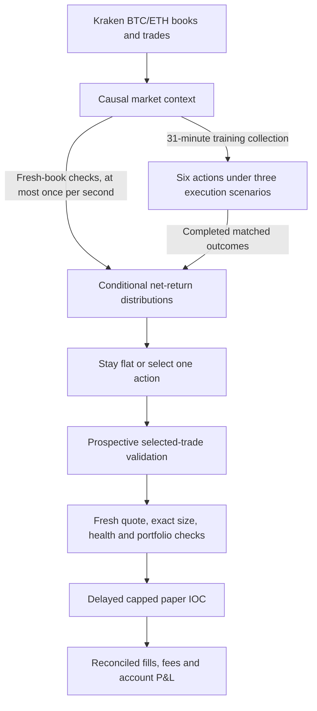

# BTC/ETH distributional engine rebuild

The prior midpoint forecast has not demonstrated an executable advantage. Increasing its training coverage did not fix that. This rebuild changes what is estimated: **the conditional distribution of executable net outcomes for a specific trade**, including its entry, exit, costs, latency and visible depth. Remaining flat is an explicit zero-return action. The implementation does not establish profitability; that requires sufficiently broad, later observed evidence.

## Fixed design



The same `DistributionController` drives engine decisions and raw-event replay. `DistributionMarket` uses reconstructed level-2 books and aggressor trades for BTC/USD and ETH/USD. Its twelve features combine top-five depth imbalance, decayed order-flow imbalance, signed trades, microprice, depth, volatility, own momentum, peer momentum, relative momentum and path efficiency. Short quote interruptions of at most 90 seconds preserve actual observed price endpoints but reset flow state; larger gaps and true reversals clear history. Missing prices are not filled in. The volatility feature is an elapsed-time variance proxy from squared log returns divided by each actual sample interval and projected to thirty minutes, not observed continuous-path realized volatility. Feature scales, action horizons and decision thresholds are fixed in source before replay; this command does not optimize them against the reported returns.

Each symbol evaluates entry opportunities on fresh book events, at most once per second, once thirty minutes of observed price history, thirty clean seconds of current flow and a synchronized peer book are available. A separate training schedule collects one shared context every 31 minutes. The six actions are long/short at 5, 15 and 30 minutes, with explicit stops, net targets and deadlines. Eighteen complete future execution paths are collected on each training opportunity: six actions times three scenarios. The scenarios are 250 ms latency, 1.5-times fees, and 750 ms latency with half the visible depth. IOC entry prices are fixed at the signal; only later books can supply fills. Exits walk later visible depth after exit latency within a frozen, tick-rounded 10 bp protection limit; an unavailable exit is invalid rather than assigned an invented retry price. Partial fills are scored against the original requested notional. Nonfills contribute zero; unknown execution paths remain invalid.

`ConditionalDistributionModel` estimates each action from nearby, preceding completed contexts. For feature distance `d`, the local weight is

```
w = exp(-d² / 2) × 2^(-(now - completedAt) / sevenDays)
```

Neighbors outside a Euclidean radius of 1.5 or farther than 1 on any feature coordinate are excluded. Weights below 0.01 are excluded. The mean is shrunk toward zero with prior weight 16. Effective sample size is `(sum w)² / sum(w²)`. Its standard error uses the larger of the weighted individual error and UTC-day clustered error. The decision score for each stress scenario is

```
shrunkMean - 2.58 × standardError - 0.1 × worstDecileNetLoss
```

The action receives its worst score across the three scenarios. The default `VALIDATED` profile requires at least 48 local observations, effective sample size 32, seven UTC dates with at least one unit of aggregate local weight each, a recent completed label, and a score strictly above 1 bp. The opt-in `PAPER_TRIAL` profile described below uses three qualifying training dates and retains the other model requirements. This is an approximate uncertainty and tail-risk rule, not a calibrated coverage guarantee under changing markets or dependence. It models observed tails, not all possible losses.

The controller selects an eligible action before seeing its outcome and reserves one global research slot across BTC and ETH. This selected action has its own three execution scenarios; its slot is released once all three selected-action paths complete, independently of the longer all-action training panel. In the default `VALIDATED` profile, selected-policy outcomes then need at least 20 completed selections across seven dates and a daily-block lower return above 1 bp under every stress before paper-order eligibility. `PAPER_TRIAL` collects this prospective evidence alongside eligible paper orders. Replaying or importing a file containing positive labels does not itself authorize trading. The engine's existing position, health, sizing, liquidity and order controls also apply.

## Entry cadence redesign

The original controller checked for entries only when starting a 31-minute
training panel. An opportunity appearing and disappearing between panels could
therefore receive no entry decision. Entry evaluation now runs from fresh book
events with an independent one-second minimum interval per symbol. This is the
earliest eligible check time, not a timer that submits an order without new data.
Missing, stale or unsynchronized books continue to block actionable decisions.
Completed outcomes available at an event can update the model before its decision;
future outcomes never inform that decision.

Training collection retains its 31-minute spacing and complete matched
six-action panels. Frequent entry checks do not turn overlapping one-second
opportunities into independent training observations. The selected policy is
validated on its own frozen action and three future execution paths. It can
consider another opportunity when that selected slot is free, without waiting
for an unrelated 30-minute training action to finish. The actual paper portfolio
still permits one trade slot across BTC and ETH, and open positions continue to
receive exit checks on incoming valid book updates.

The default selection policy is identified separately as `btc-eth-selected-policy-v2`;
the training/model version remains `btc-eth-distributional-control-v1`.
Changing entry cadence changes the selected policy. Restore retains compatible
historical training outcomes but discards prospective validation from the old
cadence. In the default profile, new prospective selections must meet the existing
sample, date and stressed-return requirements. Faster evaluation itself does not
relax the training, profitability, fresh-quote, execution or portfolio gates and does not establish
that more profitable orders will result.

The dashboard reports entry cadence and next eligible fresh-quote evaluation
separately from training cadence and next training collection. It retains the
one-second decision-expiration rule and stops displaying countdowns when
dashboard data is stale. The earlier September 7 reports linked below are
immutable evidence for the original cadence; their counts and results do not
measure this redesign.

The [September 7 cadence deployment verification](../reports/distribution-cadence-2026-09-07.json)
records 510 passing tests and matching tested/deployed runtime hashes. Replaying
the same 125,738 recorded events produced 4,857 entry evaluations instead of four,
with median gaps of 1,033 ms for BTC and 1,034 ms for ETH. All 24 emitted training
rows matched exactly. Their four panels were excluded for invalid/incomplete
paths; this comparison supplies no accepted training outcomes or profit evidence.
A second run initialized with 894 causally preceding historical samples produced
the same cadence and emitted rows without selecting trades.

The deployed paper service restored 930 training samples. It preserved all 924
samples captured before the change, plus six collected by the old service before
restart. Live observations measured median decision gaps of 1,117 ms for BTC and
1,083 ms for ETH. Both books were valid and current, database writes had no drops,
and account equity and the 106 existing order records were unchanged. Both assets
still required more qualifying training dates (three of seven); prospective
validation had zero selections. The retained rollback image is
`crypto-trade-engine:before-cadence-20260907`, with state backups under
`/app/data/backups/cadence-2026-09-07`.

## Independent horizon paper training

`DISTRIBUTIONAL_EFFICIENT_TRAINING_ENABLED=true` requires the existing paper
trial. Its selection policy is `btc-eth-selected-policy-paper-trial-3d-efficient-v1`
and its training policy is `btc-eth-independent-horizon-training-v1`. The default
remains the legacy panel collector for reproducible research comparisons.

Paired long/short origins are collected every 6, 16, and 31 minutes for the
5-, 15-, and 30-minute horizons. Every observed book advances pending outcomes;
an action learns immediately when its three execution scenarios complete
validly. Missing data excludes that action. Entry evaluations retain the
independent one-second throttle and the trial's 48 relevant samples, 32 effective
samples, three qualifying dates, stressed score above 1 bp, $12 cap, and all
execution/risk checks. This is an unvalidated paper experiment.

Startup validates and retains legacy six-action labels, then writes a checkpoint
with independent per-action banks and persisted collection clocks. Historical
imports remain strictly verified and merge without replacing valid live labels.
Old prospective selection evidence is reset on policy migration. A fresh paper
trial baseline keeps subsequent account results separate from the older policy.

Rollback requires the saved pre-deployment image and its matching legacy model
checkpoint (including its pending-selection journal, if present). Disabling the
flag against an efficient checkpoint is rejected by the new binary. Do not feed
the new per-action checkpoint to an older image, which cannot read its format.
The paper-account ledger must retain its latest state across rollback.

The existing-history study found faster label publication and mixed forecast
accuracy; neither tested conditional policy traded. See
[the study results](CONDITIONAL_STUDY_RESULTS.md) for evidence and limitations.

Deployed to the existing paper engine on 2026-09-08 at about 19:22 UTC after
642 tests and a read-only migration preflight passed. All 1,230 old labels and
362 recent price observations restored. The first four five-minute outcomes
were learned by 19:31:05 UTC, bringing the bank to 1,234 labels while entry
evaluations continued. By 19:33:30 UTC, the saved bank had 1,236 labels; an
isolated restore and idempotent historical import both passed, with every old
label retained. The image and state backups are
`crypto-trade-engine:before-efficient-training-20260908` and
`/app/data/backups/efficient-training-2026-09-08`. See the
[deployment audit](../reports/distribution-efficient-training-deployment-2026-09-08.json)
and [new trial baseline](../reports/distribution-efficient-paper-trial-baseline-2026-09-08.json).

## Opt-in three-date paper experiment

`DISTRIBUTIONAL_PAPER_TRIAL_ENABLED=true` selects `PAPER_TRIAL` for the paper
experiment; the setting defaults to `false`. Its selection policy is
`btc-eth-selected-policy-paper-trial-3d-v1`, separate from the standard validated
policy. The underlying training/model version remains
`btc-eth-distributional-control-v1`.

| Requirement | Default `VALIDATED` | Opt-in `PAPER_TRIAL` |
| --- | --- | --- |
| Qualifying local training dates | 7 | 3 |
| Local / effective samples | 48 / 32 | 48 / 32 |
| Worst stressed net-return score | Strictly above 1 bp | Strictly above 1 bp |
| Prospective selected outcomes | 20 across 7 dates before entries | Collected alongside eligible paper entries |
| Prospective stressed-return threshold | Must pass before entries | Tracked as evidence, not an entry prerequisite |
| Entry evaluation | Fresh book, at most once per second per symbol | Same |
| Training collection | Complete six-action panel every 31 minutes | Same |
| Paper cap / portfolio capacity | $12 / one shared trade slot | Same |

The trial permits testing eligible paper orders using the available shorter
training history. It does not force an order when the score, relevant sample
count, freshness, costs, sizing, liquidity or risk checks fail. Three calendar
dates of raw data do not necessarily provide three sufficiently weighted dates
or enough samples for the current market context. Paper permission and all
existing execution checks remain required; the setting does not enable real-money
trading.

Historical training outcomes remain portable between these profiles, but their
prospective selected-policy evidence is separate. Switching the selection policy
does not transfer old validation readiness. The trial stays explicitly labeled
**PAPER TRIAL · UNVALIDATED** even if its prospective observations later meet the
displayed evidence thresholds; the profile does not silently change to validated.

The dashboard displays the active training requirement as three dates and keeps
the separate prospective requirement at seven dates and twenty selections. An
ineligible current decision remains `STAY FLAT` with its actual reason, such as
`INSUFFICIENT_SAMPLES` or `SCORE_BELOW_MINIMUM`. An eligible trial decision can
enter paper execution checks while prospective readiness is false, but is never
labeled a validated entry.

Sample eligibility uses completed outcomes from similar market conditions,
which can be fewer than the stored training total. The dashboard shows relevant
samples against the required 48 and their weighted effective count against 32,
separately from stored outcomes and qualifying dates. These counts can rise or
fall as current market conditions change; they are not a countdown. At the
[21:59 UTC sample-gate check](../reports/distribution-paper-trial-sample-gate-2026-09-07.json),
BTC had 82 stored outcomes per action but 47 relevant samples, and ETH had 73
stored but 43 relevant. Both had three qualifying dates and negative stressed
scores. No threshold was reduced by this display correction.

Judge the experiment using its actual paper fills, fees and realized account
P&L recorded against the trial's starting account state. Hypothetical selected
outcomes remain separate evidence. No selected actions or no filled orders means
the experiment has not measured trading profit. Earlier deployment and backfill
reports below describe their original profiles and are not results of this trial.

The [September 7 trial deployment verification](../reports/distribution-paper-trial-deployment-2026-09-07.json)
records 535 passing tests, matching deployed runtime hashes and exact preservation
of all 930 saved training samples. Synthetic BTC long and ETH short integration
tests exercised the engine's final authorization, actual local paper-broker IOC
acceptance, delayed fills, account costs and protective exits with three training
dates and no prospective validation. These fixtures establish execution capability;
they do not measure trading profit.

At the 21:52 UTC deployment check, both assets reported `PAPER_TRIAL`, paper-order
permission enabled, a three-date training requirement and one-second entry
evaluation. Thirty-one observed decisions per asset had median gaps of 1,109 ms
for BTC and 1,112 ms for ETH. Current local support was 37 BTC samples and 28 ETH
samples, below the required 48, and all stressed scores were negative. No trial
orders had been submitted. The seven-date prospective display is informational
for this profile and does not block a qualifying trial entry.

The immutable [starting baseline](../reports/distribution-paper-trial-baseline-2026-09-07.json)
excludes all 106 earlier order records. The first
[trial outcome report](../reports/distribution-paper-trial-outcomes-2026-09-07.json)
records zero trial orders and zero account equity change. Generate later reports
from a fresh `/api/dashboard` JSON snapshot with the same baseline:

```bash
npm run --silent report:distribution-trial -- \
  reports/distribution-paper-trial-baseline-2026-09-07.json \
  /tmp/current-dashboard.json
```

Account equity changes already include paid paper fees. The report reconciles
closed position ledgers against actual fills and keeps hypothetical selected
outcomes separate. Missing or unlinked records make attribution unknown. The
rollback image is `crypto-trade-engine:before-paper-trial-20260907`; pre-trial
state copies are under `/app/data/backups/paper-trial-3d-2026-09-07`.

## Causal reconstruction and evaluation

`research:distribution` reads chronological immutable `.jsonl`/`.jsonl.gz` recordings containing `BOOK`, `TRADE`, disconnect and recorder-gap events. It rebuilds the same `LocalOrderBook`, preserving all events and the full available depth. It does not replace the raw data with top-of-book snapshots or resample away stops and quote interruptions. True per-symbol/per-stream timestamp reversals, missing resets, invalid books, stale quotes and explicit recorder gaps are counted and invalidate affected execution paths. Kraken's adapter emits a refreshed depth image with `reset: true` for every approximately 25 ms book batch; that flag does not mean a disconnect. Different symbols' original receipt timestamps can interleave backwards when these batches are emitted. Replay preserves engine-emission order instead of sorting or declaring those cross-stream interleavings corrupt. The adapter checks exchange sequences upstream, but the replay cannot independently verify consecutive exchange messages or a checksum from the batched depth images. Price paths within each recorded batch are unavailable.

Learning is online: only complete outcomes observed by the current event may affect a decision. Replay records the decision independently of its later outcome. Validation and later-period boundaries are specified on the command line. A training opportunity whose longest path crosses into the later period is removed jointly from the six-action comparison. Common action comparisons require all six actions and all three scenarios; one missing/invalid path excludes that training opportunity. Selected-policy assessment follows the independently selected action's three paths and purges crossings of those paths, without waiting for unrelated training actions. The report retains selected-policy invalid counts; a missing selected return makes its original-denominator mean unknown, never zero. Raw replay v2 accumulates inference and outcome summaries as events arrive, retaining only active opportunities by default. Full decision and outcome arrays require `--include-outcomes`.

Flat decisions and genuine nonfills earn zero. Zero fills do not establish profits. Fixed action rows are diagnostics, not a search for a profitable hindsight winner. Since the recordings were already available while designing the rebuild, the later period is a chronological evaluation period, **not an untouched holdout**. Matched actions and scenarios are dependent.

Reproduce a recording replay with explicit boundaries and archived instrument rules:

```bash
npm run research:distribution -- \
  --validation-start=2026-09-07T01:00:00Z \
  --later-start=2026-09-07T03:00:00Z \
  --assets=reports/distribution-instrument-rules-2026-09-07.json \
  --include-outcomes \
  /tmp/distribution-recorded-20260907T044916Z.jsonl.gz
```

`--assets` accepts a JSON map from symbol to `AssetRules`; omitted rules are discovered from the existing public Kraken instrument loader and identified as current, not historical. Every input file is hashed with SHA-256 and rejected if its size or modification time changes while replaying. Gzip truncation is an error. Optional `--state-out=FILE` creates a new offline checkpoint; it does not install it or submit orders. Configured paper fees and a reserve represent costs; actual historical funding cash flows are unavailable.

## Recorded-data evidence

### Historical training backfill

The default seven-date training rule measures dates in completed market observations,
not days since deployment. Full historical Kraken Futures books and trades can
therefore train the model before deployment. This is separate from the recent
thirty-minute price-history warmup and from prospective selected-policy validation.

```bash
npm run research:distribution:train -- \
  --state-out=/tmp/prepared-distribution-training.json \
  --assets=reports/distribution-instrument-rules-2026-09-07.json \
  --cutoff=2026-09-07T18:07:03Z \
  /path/earliest-recording.jsonl.gz /path/next-recording.jsonl.gz
```

Use immutable recordings in original chronological order from the same venue
and instruments as production. The command replays every raw book and trade;
it retains only complete six-action panels under all three execution stresses.
Future events beyond the explicit cutoff are excluded. The output includes input
SHA-256 hashes, costs, instrument rules, coverage and exclusions. Truncated gzip,
changing files and existing output paths fail preparation. Optional
`--state-in=EARLIER_ARTIFACT` resumes from labels completed before every admitted
event in the next input. It cannot seed an earlier replay with later outcomes.

Set `DISTRIBUTIONAL_TRAINING_FILE` to the prepared file before starting the
service. Startup validates the artifact and merges historical panels with the
existing checkpoint; current panels take priority over overlapping history.
Malformed, future, incompatible or conflicting evidence is rejected before the
running model changes. Reimporting an already incorporated artifact is idempotent.
Adding training changes the model and clears its old prospective evidence.
Historical replay selections never grant live validation or paper permission.

Under the default profile, training can still remain gated after import: seven sufficiently weighted local
dates, 48 local samples, 32 effective samples, recent outcomes and positive
stressed net scores are separate requirements. Seven raw calendar dates alone
are insufficient. Live prospective selections also remain a separate requirement.
The opt-in paper experiment uses the three-date requirement described above.
The local Kraken recordings found on September 7 cover at most five dates:
August 27 and September 4–7. The August 23 recording uses the previous Alpaca
venue and is excluded; August 25 has only ETH and cannot supply joint context.

The completed September 7 backfill processed **8,930,114 recorded events** from
21 immutable files (4,079,695,169 compressed bytes). It retained **149 complete
panels / 894 action samples** and excluded 93 panels with missing or invalid
execution paths. BTC has 79 historical samples per action; ETH has 70. Valid
panels cover August 27 and September 5–7: September 4 contributes no complete
panels after warmup and execution checks. Four raw training dates are an upper
bound on the dates that qualify for any particular current market context.
The [immutable training artifact](../reports/distribution-training-2026-09-07.json)
records each retained outcome, input hash, cost and instrument-rule assumption.
It contains zero prospective validation observations and grants no order permission.

The import preflight preserved the current 72 samples, identified ten duplicate
panels and added 834 historical samples, producing 906 total samples (80 per BTC
action, 71 per ETH action). [Deployment and verification evidence](../reports/distribution-history-training-2026-09-07.json)
records the actual startup result. All 492 tests passed. Full recorded replay
comparisons verified the performance changes without changing action outcomes:
deferred feature calculation, shared execution-book validation, ordered-book
reconstruction and bounded market-feature copies.

Startup initially rejected the artifact because exponentiation represented BTC's
decimal quantity increment `0.0001` one floating-point step lower. The instrument
loader now parses the decimal quantum directly, matching JSON instrument rules.
The complete suite and a preflight inside the production image passed after this
fix; strict provenance checks remain in force.

The corrected deployment restored all 906 samples, and both assets completed
fresh-flow warmup. At the first evaluation, each asset had three qualifying
training dates. BTC had 38 local samples / 36.40 effective samples; ETH had 51 /
48.15. Entries remained `INSUFFICIENT_DAYS`; BTC also remained below the separate
48-local-sample minimum. Prospective validation remained empty. The paper account
still had 106 historical orders, no active positions and equity 99,998.2826974.
Deployed code hashes matched the tested build.

Kraken's public historical [order events](https://docs.kraken.com/api-reference/market-history/get-public-order-events)
and [execution events](https://docs.kraken.com/api-reference/market-history/get-public-execution-events)
can supply older events, but a bounded lifecycle window omits resting orders
created before it. These endpoints need a validated initial full book and stream
reconstruction before serving as equivalent depth history. Candles cannot supply
the missing depth, aggressor flow, execution paths or client receipt timing.

At the original reconstruction, the engine's recording volume contained approximately 4 GiB of compressed raw book/trade archives covering September 4–7, 2026, plus the active recording. This was materially richer than the earlier sampled market-card quotes, but still less than the seven days required by the default profile. The active gzip stream was not treated as an immutable research file.

The completed bounded reconstruction used immutable archive `continuous-events.20260907T044916Z.jsonl.gz`: **736,373 events** from September 6 at 23:51:59.050 UTC through September 7 at 04:49:13.406 UTC. It reconstructed 691,367 book images and 44,964 trades in 480.68 seconds. There were no invalid books, true timestamp reversals, stale provider quotes or explicit recorder gaps. The 105,284 cross-stream receipt interleavings are normal batching behavior, not missing-data incidents. Both recorded disconnects remain in the replay.

[The full artifact](../reports/distribution-rebuild-2026-09-07.json) includes input SHA-256, source hashes observed before launch, instrument rules, frozen decisions, all outcome rows, exclusions and the limits of the shared build during concurrent implementation. The public [instrument rules](../reports/distribution-instrument-rules-2026-09-07.json) were retrieved from Kraken on September 7; historical instrument-rule snapshots are unavailable.

| Observation | Result |
| --- | ---: |
| Original paired opportunities | 16 |
| Complete common panels, including initial learning | 10 |
| Valid action samples, each with three matched stresses | 60 |
| Samples per symbol and action | 5 |
| Invalid panels | 6 |
| Validation opportunities purged at the later-period boundary | 2 |
| Common validation opportunities per asset after purging | 2 |
| Common later-period opportunities | 0 |
| Model-selected actions / paper-eligible decisions / broker orders | 0 / 0 / 0 |

Two invalid panels originated at 01:54:59 and missed an exit-arrival deadline. The remaining four originated at 03:27:59 and 04:25:18 and were interrupted by disconnects. Those later-period exclusions leave **no matched later-period performance estimate**. The fixed action diagnostics are based on only two validation opportunities per asset and do not support choosing a profitable strategy. Sixty action samples are not sixty independent trades: six actions and three stresses share each opportunity.

This run verifies that the rebuilt engine collects executable outcome distributions from the actual feed. It does **not** demonstrate profitability: there were no selected trades, the local sample and seven-day requirements were unmet, and later-period comparison coverage was absent. Six focused replay tests and the TypeScript build passed. This offline replay did not deploy a container or submit broker orders; engine deployment is recorded separately.

The [bootstrap checkpoint](../reports/distribution-bootstrap-2026-09-07.json) contains exactly the 60 observed action samples from the ten complete panels, plus provenance linking the input recordings, replay report and instrument-rule hashes. It was restored into the current controller and exported again, then independently restored and validated. It has **five samples per symbol/action, zero selected-policy validation observations, zero pending selections, and no paper-order eligibility**. It preserves collected labels without claiming a profitable model. Instrument rules are recorded in provenance; the checkpoint currently enforces matching costs and sample contracts but does not enforce an instrument-rule fingerprint.

## Running paper engine and recovery

The replacement was deployed on September 7 with configuration
`btc-eth-distributional-v11.0.0`. [Deployment evidence](../reports/distribution-deployment-2026-09-07.json)
records the validated artifact hashes, the deployed core file hashes, and the
running snapshot. All **439 tests** and the build passed. The container is healthy;
both BTC/ETH books are valid; the database is connected with no dropped records.
The engine restored all 60 bootstrap samples, has zero selected-policy validation
observations, and submitted zero new-model orders at the deployment check.
Completed training labels survive the restart. Recent observed price history now
also survives deployment as described below. Paper permission being enabled is separate from a qualified
entry. The earlier Bayesian model cannot submit while the replacement is active.

### Historical market warmup

`DISTRIBUTIONAL_HISTORY_FILE` defaults to the model state filename plus
`.market.json`. The running service saves the bounded BTC/ETH price history every
five seconds and captures it before shutdown clears market state. Startup restores
this file after the separate training checkpoint. It contains actual ten-second
price samples and their original timestamps; it cannot restore executable quotes,
decisions, training outcomes, prospective evidence or orders.

With a complete recent thirty-minute window, the first evaluation needs roughly
thirty seconds of fresh live book and trade-flow context after both feeds resume,
instead of another thirty minutes of price collection. Instrument discovery and
other startup work precede that interval. The restored tail and the first new
book must be within the existing ninety-second price-gap limit. Longer downtime,
stale tails, invalid history or missing coverage require normal live warmup.
Partial recent history can shorten the remaining price collection. Future or
malformed samples reject the whole document before market state changes.

To prepare a compact history file before the first deployment, process **frozen,
complete** raw recordings in their original chronological order:

```bash
npm run research:distribution:warmup -- \
  --out=/tmp/prepared-distribution-market.json \
  /tmp/frozen-previous.jsonl.gz /tmp/frozen-recent.jsonl.gz
```

The command reconstructs and validates every recorded book, preserving the
ten-second sampling cadence. Short public disconnects may retain actual price
endpoints within the ninety-second bound; missing recorded events and invalid
books clear the context. It produces a compact history file and prints a JSON
report with input hashes and coverage. It has no order-routing or model
training capability. Install the compact file at `DISTRIBUTIONAL_HISTORY_FILE`
just before startup; a historical archive ending hours ago cannot bypass the
recent-tail requirement. Do not read a changing gzip file directly: freeze it
first, and retry preparation if the copy ends inside an incomplete gzip member.
For older archival cutoffs, `--as-of=ISO_TIMESTAMP` makes the evaluation time
explicit; startup still rechecks freshness against its actual current time.

The dashboard displays observed price coverage, fresh-flow coverage, restored
sample counts and current readiness for both assets. Progress follows actual
received observations. Completing this warmup enables model evaluation; the
active profile's training, validation and execution requirements still determine order eligibility.

Brief public-feed disconnects also retain recent observed price endpoints. The
first returning book must be within ninety seconds of the last clean book;
otherwise the thirty-minute price warmup starts again. Quotes, order flow and
pending execution paths are invalidated immediately, and both assets must supply
fresh books plus thirty seconds of new flow before entry evaluation resumes.
Repeated reconnects cannot refresh old price timestamps. Recorder gaps and
invalid-data resets still clear history. Recorded public disconnects use the
same recovery rule as the running engine.
The recovery policy versions are `btc-eth-selected-policy-v3` and
`btc-eth-selected-policy-paper-trial-3d-v2`. Earlier complete training labels
remain usable; earlier prospective selection evidence does not carry forward.

The [September 7 startup verification](../reports/distribution-history-startup-2026-09-07.json)
prepared 360 retained price samples from 62,296 recent recorded events and deployed
them to the existing paper service. BTC evaluated 30.248 seconds after the new
public feed connected; ETH evaluated after 30.222 seconds. Both markets reached
`READY`, and both decisions stayed flat with `INSUFFICIENT_DAYS`. Periodic history
updates were observed afterward. All 458 tests and the build passed, and deployed
core hashes matched the tested build. An initial preparation from full archives
became stale before startup and was rejected; the successful retry used a frozen
recent input window. These checks establish faster market warmup, not profitability.

The entry planner binds a decision to its quote, costs, exact requested size and
research identity. Dispatch rebuilds the economic plan and independently checks
the portfolio slot before reserving an order. The new paper IOC fills only on a
fresh book at or after the declared 250 ms arrival and within its one-second
expiry. Entry holding times start at the first fill's event timestamp, including
partial fills. Only real book events trigger normal policy exits. Once an exit
has triggered, it remains latched across price recovery and restart.

The shadow outcome and paper broker share tested arrival, cap, fee, and exit
rules. Live health, liquidity, exact-size and position checks can still exclude
a selected shadow trade. Live failed exits also retry to remove exposure, while
replay treats an unavailable exit path as invalid. Therefore shadow validation
is not a claim that paper account returns will equal replay returns. Actual
fills, fees and realized account P&L remain separate evidence.

State checkpoints retain validated complete six-action panels and link
prospective evidence to the original frozen selected decisions. A small,
synchronously written and flushed pending-selection journal is recorded before
dispatch. An unresolved selection after a crash clears prospective validation;
it cannot disappear while an older positive summary remains eligible. Full
checkpoints replace atomically, and malformed or future evidence is rejected
before replacing the current model. An interrupted pending selection at a clean
handoff likewise clears validation. Missing endpoints are never counted as
zero-return trades.

## Research basis and scope

Cont, Kukanov and Stoikov found that short-term price changes were associated with order-flow imbalance and market depth in their study of U.S. equities. This motivates testing those inputs here; it is not evidence of a Kraken BTC/ETH trading profit. [The Price Impact of Order Book Events](https://arxiv.org/abs/1011.6402).

Boyd and coauthors describe trading decisions that balance expected return, risk and costs, while explicitly leaving the forecasting problem outside their contribution. This rebuild follows that separation between estimating outcomes and deciding whether a trade merits its costs; it does not implement their multi-period convex optimizer. [Multi-Period Trading via Convex Optimization](https://web.stanford.edu/~boyd/papers/cvx_portfolio.html).

Bailey and coauthors explain how searching many strategies on finite data can create apparently profitable backtests. The rebuild therefore retains prespecified action comparisons, chronological evaluation and failed/invalid outcomes. These measures reduce opportunities for selective reporting; they are not an implementation of their probability-of-backtest-overfitting estimator or proof against overfitting. [The Probability of Backtest Overfitting](https://www.davidhbailey.com/dhbpapers/backtest-prob.pdf).
