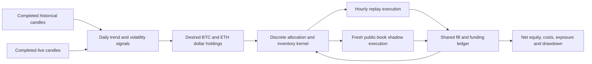

# Persistent BTC/ETH portfolio rebuild

This rebuild changes the strategy's unit of control from a timed round trip to desired inventory. It maintains BTC and ETH positions, adjusts only the difference from the desired holdings, and records each execution fee and funding cash flow. The replay adapter and the public-market shadow process use the same allocation and accounting kernel.

The first candidate is a fixed multiscale trend policy. Its profitability is an empirical question. No method in this implementation is described as the best mathematical model or as a guaranteed source of profit.



## Mathematics and trading behavior

For each asset, the strategy computes 30-, 90-, and 360-day log returns, normalizes each by the trailing 60-day RMS daily return times the square root of its lookback, clips each normalized value to [-1, 1], and averages them. Relative inverse-volatility weights allocate the common $12 budget; weak signals leave capacity unused. These scores express trend strength. They are not expected returns or calibrated probabilities.

The planner jointly searches feasible BTC and ETH lot quantities under the same $12 executable gross-notional limit. It minimizes squared dollar tracking error divided by $12, plus estimated spread and fee costs in dollars. This is a declared tracking objective with transaction costs, not an estimate of trading profit. A fixed 25% band suppresses small changes to existing same-direction exposure. The planner reports desired and executable holdings separately because BTC's minimum lot can be larger than a nominal half-budget allocation.

Positions have no fixed 24-hour expiry. A change of direction closes existing exposure first and waits for confirmation before opening the opposite side. Pending and partially filled orders retain their reservations. Missing or stale quotes cannot create fills. Valid expired or invalidated targets request a reduction to flat when fresh executable quotes become available. Marked exposure can exceed $12 between checks as prices move; increases respect the cap and reductions address excess exposure.

Trend following and implementation costs have an established research literature, but that literature does not validate this particular BTC/ETH policy. See [time-series momentum data and original paper](https://www.aqr.com/Insights/Datasets/Time-Series-Momentum-Original-Paper-Data) and [momentum implementation research](https://www.aqr.com/Insights/Research/Working-Paper/Implementing-Momentum-What-Have-We-Learned).

## Accounting and evidence

The ledger uses signed quantities, weighted average entry cost, realized P&L on partial reductions, actual fill fees, and separately identified funding cash flows. Slippage is embedded in execution prices and is not subtracted a second time. Durable receipts make duplicate fills and funding idempotent and allow balances to be reconstructed on restart.

Historical funding uses signed contract units times Kraken's archived absolute rate. Both plausible archive timestamp interpretations are tested. The timestamp alternatives are sensitivities, not verified exhaustive bounds. A missing required funding payment makes full net P&L unknown. The [funding review](../reports/funding-timestamp-review-2026-09-09.json) records source coverage and the unresolved convention; [Kraken's specifications](https://support.kraken.com/articles/4844359082772-linear-multi-collateral-derivatives-contract-specifications) explain the cash-flow mechanism.

All policies face identical execution scenarios: a one-hour delay with 5bp fee and 1.5bp adverse price adjustment per side, and a two-hour delay with 7.5bp fee, 3bp price adjustment and an extra 1bp/day funding cost. Each runs under both funding timestamp interpretations. Replay fills are hourly-open proxies; they do not establish real order-book fillability. Zero-volume failures resolve at the candle close and retain reservations until then. The final 48 hours request liquidation, with unresolved inventory classified as unknown.

The fixed comparisons are the multiscale candidate, a simpler 90-day sign strategy, constant-dollar BTC, constant-dollar ETH, and flat. Constant-dollar benchmarks use the same cap and adjustment engine; they are not literal fixed-unit buy-and-hold portfolios.

The sequence is 2024 development, previously inspected 2025 confirmation, then reserved January–July 2026. Source, data, protocol, scenario artifacts and stage receipts are sealed. A failed stage prevents later performance evaluation. Acceptance requires positive net returns for the portfolio and both assets in every scenario, bounded drawdown, meaningful exposure, and better net-minus-half-drawdown utility than flat and the simple rule. Constant-asset comparisons remain visible. Final acceptance also requires positive nominal paired weekly lower bounds against flat and the simple rule. Repeated prior research and funding/execution limitations remain explicit.

## Commands

The new implementation has its own entry points and checkpoint. Existing distributional training banks and prior sealed studies are preserved.

```bash
npx tsx src/portfolio/study-main.ts register OLDER_DATASET RECENT_DATASET OUTPUT_DIRECTORY
npx tsx src/portfolio/study-main.ts develop OLDER_DATASET RECENT_DATASET OUTPUT_DIRECTORY
npx tsx src/portfolio/study-main.ts confirm OLDER_DATASET RECENT_DATASET OUTPUT_DIRECTORY
npx tsx src/portfolio/study-main.ts test OLDER_DATASET RECENT_DATASET OUTPUT_DIRECTORY
npx tsx src/portfolio/live-main.ts preflight OUTPUT_DIRECTORY
npx tsx src/portfolio/live-main.ts shadow OUTPUT_DIRECTORY data/portfolio-shadow.json
```

The shadow process requires completed historical scenario gates before it downloads a live warmup. It reads public production quotes, uses virtual IOC fills, and publishes status at `http://127.0.0.1:3002/api/status`. It has no real-order dispatch capability. History retrieval runs independently of quote and position management. Checkpoint ownership prevents concurrent writers; invalidation, pending orders and inventory survive restart.

Shadow status distinguishes execution-only equity from fully costed net profit. Funding coverage is not inferred from absent receipts, so fully costed shadow profit remains unavailable until a complete verified funding reconciliation is implemented. Passing a software test or historical gate cannot remove that limitation.

## Validation status

The first source-sealed comparison is complete. The full software suite passed 912 tests and the TypeScript build passed. An independent reconstruction reconciled all 20 accounts, including 2,162 fills and 179,304 funding settlements; its largest hourly equity discrepancy was below $0.000000002.

The multiscale policy generated positive 2024 net returns in all four execution/funding scenarios, but **failed** its preregistered risk and simple-strategy comparison gates. These are development results from a previously studied year, not proof of future profitability.

| 2024 policy | Base net PnL | Stress net PnL | Maximum drawdown across scenarios |
| --- | ---: | ---: | ---: |
| Multiscale trend | $3.25 | $3.14 | $4.66 |
| Simple 90-day trend | $6.49 | $5.79 | $3.29 |

Both policies used the same $12 shared gross-notional cap. The allowed maximum drawdown was $3. The simple strategy also exceeded the $1.20 daily-loss limit. The base and stress figures above round two funding-timestamp sensitivity scenarios; full scenario and per-asset results are preserved in `reports/portfolio-rebuild-2026-09-09/develop-summary.json`.

Confirmation, reserved-period testing and public-market activation were denied by the failed development gate. No candidate has been activated. The next revision is separate in `src/portfolio-v2/`: it adds an execution-enforced risk budget and development-only strategy selection. It does not change this study's source seal or convert its failed result into a pass.
